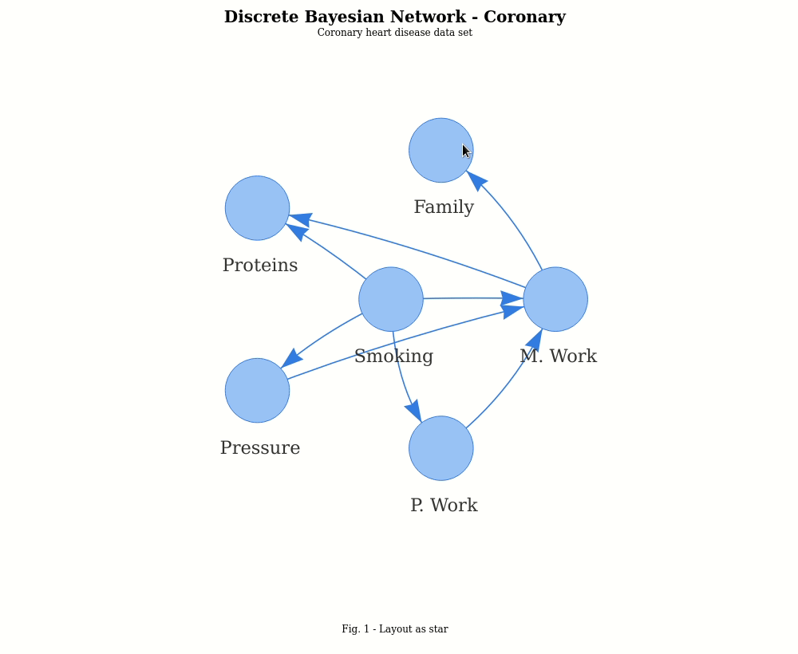

<p align="center">
 <b style='font-size:40px;'>BNViewer</b>
</p>
<p align="center">
 <b style='font-size:40px;'>An R package for interactive visualization of Bayesian Networks</b>
</p>

----------




**bnviewer** is an R package for interactive visualization of Bayesian Networks based on <a href="http://www.bnlearn.com/" target="_blank">bnlearn</a>, through <a href="https://datastorm-open.github.io/visNetwork/" target="_blank">visNetwork</a>. The bnviewer package reads various structure learning algorithms provided by the <a href="http://www.bnlearn.com/" target="_blank">bnlearn</a> package, such as:

 <p><em>Constraint-based structure learning algorithms</em>:</p>
 <ul>
   <li>PC (the <em>stable</em> version);</li>
   <li>Grow-Shrink (GS);</li>
   <li>Incremental Association Markov Blanket (IAMB);</li>
   <li>Fast Incremental Association (Fast-IAMB);</li>
   <li>Interleaved Incremental Association (Inter-IAMB);</li>
   <li>Max-Min Parents &amp; Children (MMPC);</li>
   <li>Semi-Interleaved Hiton-PC (SI-HITON-PC);</li>
 </ul>
 <p><em>Score-based structure learning algorithms</em>:</p>
 <ul>
   <li>Hill Climbing (HC);</li>
   <li>Tabu Search (Tabu);</li>
 </ul>
 <p><em>Hybrid structure learning algorithms</em>:</p>
 <ul>
   <li>Max-Min Hill Climbing (MMHC);</li>
   <li>General 2-Phase Restricted Maximization (RSMAX2);</li>
 </ul>
 <p><em>Local discovery algorithms</em>:</p>
 <ul>
   <li>Chow-Liu;</li>
   <li>ARACNE;</li>
 </ul>
      
Installation
------------

**bnviewer** is available for developers, install from GitHub.

``` r
install.packages("devtools")
devtools::install_github("robson-fernandes/bnviewer")
```

How to use
----------

``` r
library(bnlearn)
library(bnviewer)
```

``` r
data("alarm")
bn.learn.hc = hc(alarm)
```


``` r
plot(bn.learn.hc,
     bayesianNetwork.width = "100%",
     bayesianNetwork.height = "80vh",
     bayesianNetwork.layout = "layout_with_sugiyama",
     bayesianNetwork.title="Discrete Bayesian Network - Alarm",
     bayesianNetwork.subtitle = "Monitoring of emergency care patients",
     bayesianNetwork.footer = "Fig. 1 - Layout with Sugiyama",
     edges.dashes = FALSE
)
```


``` r
plot(bn.learn.hc,
     bayesianNetwork.width = "100%",
     bayesianNetwork.height = "80vh",
     bayesianNetwork.layout = "layout_on_grid",
     bayesianNetwork.title="Discrete Bayesian Network - Alarm",
     bayesianNetwork.subtitle = "Monitoring of emergency care patients",
     bayesianNetwork.footer = "Fig. 1 - Layout on grid",
     edges.dashes = FALSE,

     node.colors = list(background = "#f4bafd",
                        border = "#2b7ce9",
                        highlight = "#97c2fc")

)
```


``` r
plot(bn.learn.hc,
     bayesianNetwork.width = "100%",
     bayesianNetwork.height = "80vh",
     bayesianNetwork.layout = "layout_in_circle",
     bayesianNetwork.title="Discrete Bayesian Network - Alarm",
     bayesianNetwork.subtitle = "Monitoring of emergency care patients",
     bayesianNetwork.footer = "Fig. 1 - Layout in circle",
     edges.dashes = FALSE,

     node.colors = list(background = "red",
                        border = "black",
                        highlight = "black")

)
```

